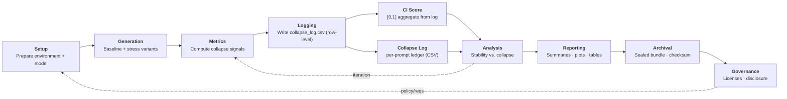

  

> ⚠️ **Note:** The `main` branch is read-only. No formulas or metric implementations are released here.

---

<b>🏷️ Project Identity</b>

  
  
  
  

<b>📦 Repository Status</b>

  
  
  
  
  

<b>💬 Community & Support</b>

  
  
  
  

---

# Collapse Index (CI)

  <em>A diagnostic framework for instability in complex systems.</em>

---

<b>📚 Table of Contents</b>

- [🤔 What is CI?](#-what-is-ci)
- [➡️ Schematic Workflow](#-schematic-workflow)    
- [📍 Positioning CI](#-positioning-ci)  
  - [Diagnostic Features](#diagnostic-features)  
  - [Notes](#notes)  
- [📑 What is the Collapse Log?](#-what-is-the-collapse-log)  
  - [📋 Collapse Log Example (snippet)](#-collapse-log-example-snippet)  
- [📊 Collapse Log in Context](#-collapse-log-in-context)  
- [⭐ Why CI + Collapse Log Matter](#-why-ci--collapse-log-matter)  
- [🚀 Try the Toy Demo (illustrative only)](#-try-the-toy-demo-illustrative-only)  
- [❓ FAQ](#-faq)  
- [🗺️ Roadmap 2025](#️-roadmap-2025)  
- [⚠️ Official Status](#️-official-status)  
- [📄 License & Attribution](#-license--attribution)  
- [🧑🏻‍🔬 Author](#-author)  
- [💖 Sponsors](#-sponsors)  

---

## 🤔 What is CI?  

**CI is a diagnostic framework for detecting when complex systems suddenly fail under small, ordinary stresses.**  

- **Bounded scores (0–1):** Clear, comparable measure of instability.  
- **Lightweight stressors:** Simple, benign perturbations (no heavy adversarial pipelines).  
- **Reproducibility:** Each run produces sealed artifact bundles (logs, hashes, plots) for independent verification.  

CI complements existing metrics like calibration, robustness, and OOD detection by acting as a **tripwire for hidden brittleness**.  
It is designed for **audit, governance, and deployment settings**, not leaderboard gaming.  

---

## Collapse Index (CI) Workflow

The **Collapse Index (CI)** is more than a metric: it’s a pipeline.  
Each run produces both a **bounded CI score** and a **collapse log** (row-level ledger of outcomes),  
then seals everything into an **audit-grade bundle**.  
  
This flowchart shows how CI integrates into evaluation, from setup to governance. 

 
> The CI framework integrates into the evaluation pipeline at two points:  
> • **Metrics (CI score):** collapse quantified into a bounded [0,1] score.  
> • **Collapse Log:** detailed, row-level record of every prediction and outcome.  
>  
> These plug into the broader evaluation cycle (analysis → reporting → archival → governance), producing sealed, audit-grade evidence of system stability.  

---

## 📍 Positioning CI  

### Diagnostic Features

| Method / Paper                | Bounded | Stress-based | Lightweight | Audit-aligned | Modality-agnostic |
|-------------------------------|:-------:|:------------:|:-----------:|:-------------:|:-----------------:|
| **Collapse Index (CI)**       | ✓       | ✓            | ✓           | ✓             | ✓                 |
| **HELM**                      | ✗       | ✗            | ✗           | ✗             | ✓                 |
| **Calibration / Confidence**  | ✗       | ✗            | ✓           | ✗             | ✓                 |
| **OOD Detection**             | ✗       | Partial      | ✓           | ✗             | ✓                 |
| **Adversarial Robustness**    | ✗       | ✓            | ✗           | ✗             | ✓                 |
| **Audit / Repro Standards**   | ✗       | ✗            | ✗           | ✓             | ✗                 |
| **Industry Auditors**         | ✗       | Partial      | ✗           | ✗             | ✗                 |

### Notes

- **Collapse Index (CI)** → Defines collapse as structured instability; integrates reproducibility into the diagnostic itself  
- **HELM** → Large-scale, multi-metric evaluation; not bounded, not collapse-specific  
- **Calibration / Confidence** → Improves probability alignment but misrepresents brittleness under stress  
- **OOD Detection** → Captures distributional shift; lacks bounded collapse diagnostics  
- **Adversarial Robustness** → Reveals fragility but computationally heavy; not suited to lightweight diagnostics  
- **Audit / Repro Standards** → Define research process; do not provide diagnostic metrics  
- **Industry Auditors** → Proprietary scores; not bounded or reproducible  

---

## 📑 What is the Collapse Log?

Every run produces a **Collapse Log** — an audit-grade CSV file that  
records per-prompt diagnostics, predictions, and human-friendly notes.  

Think of it as a **flight recorder for brittleness**:

- **Row-level evidence** — Each base input is logged with its  
  confidence, entropy, and error status.  
- **Interpretive notes** — The log adds a plain-English tag (e.g. *“error, brittle case”*,  
  *“correct, high conf”*) so the file can be skimmed by both humans and machines.  
- **Receipts-grade** — The file is bundled alongside hashes and snapshots, ensuring that  
  results are **verifiable and audit-ready**.  
- **Portable** — CSV format, lightweight, and works across pipelines.   

---

### 📋 Collapse Log Example (snippet)

| prompt_id | label | confidence | entropy | is_error | notes              |
|-----------|-------|------------|---------|----------|--------------------|
| 12        | 1     | 0.9453     | 0.1124  | 0        | correct, high conf |
| 27        | 0     | 0.4187     | 0.6932  | 1        | error, brittle case|
| 35        | 1     | 0.7321     | 0.3558  | 0        | correct, stable    |

---

## 📊 Collapse Log in Context

Collapse Log strengthens any metric by making results **transparent and auditable**.  
Here’s how it compares across common baselines vs. CI:

| Metric Family          | Without Collapse Log | With Collapse Log | Added Value |
|------------------------|----------------------|--------------------|-------------|
| **Confidence / Entropy** | Detects low certainty, but hides row-level behavior | Every prediction, confidence, and entropy recorded | Turns a black-box score into an **auditable ledger** |
| **Calibration / OOD**  | Reports AUROC or coverage curves only | Logs corner cases, OOD spikes, and per-sample traces | Adds **traceability** — reviewers can see where failures happened |
| **Adversarial Robustness** | Heavy compute, aggregate-only | Row-level evidence of stress-test outcomes | Makes robustness runs **inspectable** without reruns |
| **Collapse Index (CI)** 🚀 | Aggregated CI signals | Full **collapse-sensitive forensic record** (spikes, flips, margins logged) | Collapse Log + CI = **audit-grade diagnostics** |

👉 **Takeaway:** Collapse Log alone adds accountability,  
but Collapse Log + CI unlocks a **unique diagnostic ledger** regulators and reviewers can trust.

---

## ⭐ Why CI + Collapse Log Matter  

AI models don’t fail quietly — they **collapse**.  
Traditional metrics often miss brittleness until it causes real-world harm.  

- **Benchmarks ≠ Reality** → models that ace leaderboards can still collapse.  
- **Liability Risk** → a single collapse may trigger recalls, lawsuits, or penalties.  
- **Audit Gap** → standard metrics don’t leave receipts; Collapse Log™ does.  
- **Efficiency** → lightweight stressors mean continuous monitoring without massive compute.  
- **Trust** → regulators and enterprises need a score they can verify **and a log they can audit.**  

👉 CI + Collapse Log make collapse **measurable, reproducible, and audit-ready** before it becomes a public liability.  

---

## 🚀 Try the Toy Demo (illustrative only): 

You can run it directly on Kaggle:
-  - Coming soon   

👉 See the [toy-demo branch](https://github.com/collapseindex/collapseindex/tree/toy-demo)  
for a workflow that produces logs, plots, and reproducibility snapshots.  

*(Not the full Collapse Index protocol.)*  

---

## ❓ FAQ  

❔ **Is CI just another benchmark?**  
➡️ No. CI is not a leaderboard metric — it’s a diagnostic. It reveals brittleness under benign stress.  

❔ **Does CI replace calibration, OOD, or adversarial robustness?**  
➡️ No. CI complements these methods. It adds a collapse-sensitivity axis and receipts (Collapse Log™).  

❔ **Is CI adversarial?**  
➡️ No. CI relies on lightweight, domain-appropriate perturbations (e.g., paraphrases, pixel shifts). Collapse is measured without adversarial tuning.  

❔ **How reproducible are CI runs?**  
➡️ Every run emits a full artifact bundle: logs, plots, cryptographic hashes, and a Collapse Log.  

❔ **Does CI scale?**  
➡️ Yes. CI stabilizes at a small perturbation budget, so continuous monitoring is feasible without massive compute overhead.

---

## 🗺️ Roadmap 2025

- **Finalize arXiv draft and publish** 
- **Run additional experiments** — scaling to larger models (e.g., Qwen 7B) 
- **Collaborate with labs and organizations** — external validation and pilots 
- **Build diagnostic software/app** — packaging CI + Collapse Log as a tool  

---

## ⚠️ Official Status  

Collapse Index (CI) and Collapse Log are **not released as open-source software.**  
There is **no official repository** providing formulas or internals.  

Any third-party code claiming to implement CI or Collapse Log is:  
🚫 **Unofficial, unverified, and not endorsed.**  

---

## 📄 License & Attribution  

- The terms *Collapse Index™ (CI)* and *Collapse Log™* are reserved by the author.  
- Unauthorized use or misrepresentation is prohibited.  
- This repo does not contain source code or formulas.  

📄 See [LICENSE.md](LICENSE.md) and [CITATION.md](CITATION.md).  

---

## 🧑🏻‍🔬 Author  

Collapse Index Labs (A. Kwon)  
- Website → [collapseindex.org](https://collapseindex.org)  
- ORCID → [0009-0002-2566-5538](https://orcid.org/0009-0002-2566-5538)  

For verified reproducibility kits or pilots, contact:  
📩 **ask@collapseindex.org**  

---

## 💖 Sponsors  

Collapse Index research is made possible through community support.  

### 📡 Transmission Tier (Major Sponsors)  
*Be the first founding Transmission sponsor.*  

### 📻 Feedback Tier (Contributors)  
*Be the first founding Feedback sponsor.*  

👉 [Sponsor CI on GitHub](https://github.com/sponsors/collapseindex)  

---
